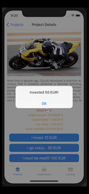
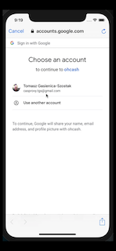
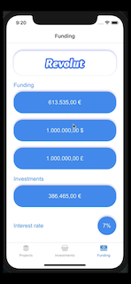

# OhCash

Crowdfunding mobile p2p lending solution. The app allows for adding projects to apply for a crowdfunding financing.

### Running the app

Run `npm install` from the project directory.

Install **Expo** app on your smartphone.

Start the server by running `/server/index.js` and the front end with `expo start`.

Make sure the server and the smartphone run on the same WIFI network and change the url in the `reducer.js` to the IP of your network.

You have to create mock data for projects.

## Tech stack

**Front-end**

* [React-Native](https://facebook.github.io/react-native/)
* [Redux](https://redux.js.org/)

Front-end components are located in the `screens` folder.

**Back-end**

* [Node.js](https://nodejs.org/en/)
* [Koa](https://koajs.com/)
* [Mongoose](https://mongoosejs.com/)
* [mLab](https://mlab.com/)

Back-end files are located in the `server` folder.

### Notes

Not tested on Android! The app contains some original filenames as created by Expo which may not always refer to what is seen on the screen.
